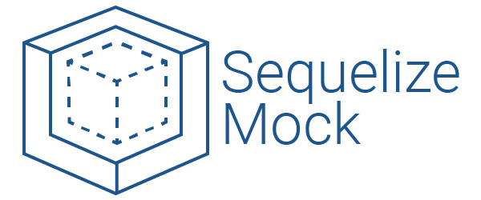

# 

Sequelize Mock is a mocking library for [Sequelize](http://sequelizejs.com). Mock objects created with this library are meant for use in testing code that relies on Sequelize Models. Code does not rely on any database connections and can therefore be easily used in unit and integration tests without requiring the setup of a test database system.

[Installation](docs/getting-started.md)

## Example Usage

```javascript
// Import the mock library
var SequelizeMock = require('sequelize-mock');

// Setup the mock database connection
var DBConnectionMock = new SequelizeMock();

// Define our Model
var UserMock = DBConnectionMock.define('users', {
        'email': 'email@example.com',
        'username': 'blink',
        'picture': 'user-picture.jpg',
    }, {
        instanceMethods: {
            myTestFunc: function () {
                return 'Test User';
            },
        },
    });

// You can also associate mock models as well
var GroupMock = DBConnectionMock.define('groups', {
    'name': 'My Awesome Group',
});

UserMock.belongsTo(GroupMock);

// From there we can start using it like a normal model
UserMock.findOne({
    where: {
        username: 'my-user',
    },
}).then(function (user) {
    // `user` is a Sequelize Model-like object
    user.get('id');         // Auto-Incrementing ID available on all Models
    user.get('email');      // 'email@example.com'; Pulled from default values
    user.get('username');  // 'my-user'; Pulled from the `where` in the query

    user.myTestFunc(); // Will return 'Test User' as defined above

    user.getGroup(); // Will return a `GroupMock` object
});
```
